import { Callout } from "nextra/components"
import { Steps } from "nextra/components"

# Connect GitHub for Autonomous AI Fixes

> **Turn Handit into your autonomous AI engineer.** Connect GitHub so Handit can automatically detect issues, write fixes, and ship pull requests with improved AI code—all while you sleep.

<Callout type="info">
  **Prerequisites**: You need the Handit CLI installed, a GitHub repository, and your AI running with Handit evaluation. If you haven't set up Handit yet, start with our [Main Quickstart](/quickstart).
</Callout>

## Why Connect GitHub?

**Stop being your AI's on-call engineer.** With GitHub integration, Handit becomes an autonomous team member that:

- **Detects issues automatically** - Monitors your AI 24/7 for failures and performance drops
- **Writes fixes that work** - Generates improved prompts tested on real production data  
- **Ships pull requests** - Creates PRs with proven fixes directly in your repository
- **Uses your workflow** - Integrates with your existing code review and deployment process
- **Works while you sleep** - Wake up to PRs with validated AI improvements

## Quick Setup

### Step 1: Run GitHub Setup Command

```bash filename="terminal"
handit-cli github
```

The CLI will guide you through an interactive setup:

<Steps>
### Repository Selection
- Choose the repository where your AI agent code lives
- Confirm you have admin access to install GitHub apps
- Select the branch for pull requests (usually `main` or `develop`)

### GitHub App Installation
- The CLI opens your browser to install the Handit GitHub app
- Grant permissions for repository access and PR creation
- Confirm the installation was successful

### Optimization Configuration
- Configure which LLM nodes should trigger automated PRs
- Set quality thresholds for creating optimizations
- Choose PR creation preferences (immediate vs batched)

### Test Connection
- The CLI verifies the GitHub integration is working
- Creates a test branch to confirm permissions
- Shows you where to monitor optimization status
</Steps>

## How Your Autonomous Engineer Works

### The Automated Fix Pipeline

```mermaid
graph TD
    A[🔍 Detects AI failure] --> B[🧠 Analyzes root cause]
    B --> C[⚡ Generates fix]
    C --> D[✅ Tests on real data]
    D --> E[📋 Creates pull request]
    E --> F[👀 You review & merge]
    F --> G[🚀 Fix deployed automatically]
```



### What the Pull Requests Look Like

When your autonomous engineer detects an issue and creates a fix, you'll get a PR like this:

```diff
# 🤖 Autonomous Fix: Customer Service Response Quality

## Issue Detected
❌ Customer service AI giving incomplete responses (detected at 2:14 AM)
📊 Quality score dropped to 3.2/5.0 over 247 interactions

## Fix Applied
✅ Improved system prompt for better completeness and empathy
🧪 Tested on 1,247 real customer interactions
📈 Quality improved to 4.8/5.0 (+50% improvement)

## Code Changes

### Before (causing incomplete responses)
- prompt = "You are a customer service agent. Help the customer."

### After (tested fix)
+ prompt = """You are a caring customer service agent dedicated to providing complete, helpful responses.
+ Always address every part of the customer's question and show genuine empathy.
+ If you don't have complete information, explain what you do know and how to get more help."""

## Validation Results
✅ 95% statistical confidence
✅ Tested on production data
✅ No negative side effects detected
✅ Ready for immediate deployment
```

**This is what it looks like to have an autonomous engineer on your team.**

### Configuration Options

The CLI allows you to customize the GitHub integration:

**PR Creation Settings:**
```bash
# Create PRs immediately when optimizations are ready
handit-cli github --pr-mode immediate

# Batch multiple optimizations into single PRs
handit-cli github --pr-mode batched

# Only create PRs for high-confidence improvements
handit-cli github --confidence-threshold 90
```

**Branch Management:**
```bash
# Set target branch for PRs
handit-cli github --target-branch main

# Configure PR branch naming pattern
handit-cli github --branch-pattern "handit/optimization-{node-name}-{date}"
```

## Advanced Configuration

### Works with Any Repository Structure

The autonomous engineer adapts to your existing codebase:

**Monorepo:**
```
my-app/
├── agents/
│   ├── customer-service/
│   │   └── prompts.py  ← Handit updates this
│   └── technical-support/
│       └── prompts.py  ← And this
├── handit.config.json
└── package.json
```

**Separate AI Service:**
```
ai-service/
├── src/
│   ├── prompts/  ← Handit finds and updates these
│   └── agents/
├── handit.config.json
└── requirements.txt
```

### Integrates with Your CI/CD

Handit PRs work with your existing GitHub Actions, CircleCI, or any CI/CD system:

```yaml filename=".github/workflows/ai-validation.yml"
name: Validate AI Changes
on:
  pull_request:
    branches: [main]

jobs:
  validate-ai-changes:
    if: contains(github.head_ref, 'handit/fix')
    runs-on: ubuntu-latest
    steps:
      - uses: actions/checkout@v3
      - name: Test AI changes
        run: npm test -- --ai-validation
```

## Monitoring and Management

### Dashboard Monitoring

Track your GitHub integration in the Handit dashboard:

**Optimization Status:**
- View pending optimizations waiting for PR creation
- Monitor PR creation success/failure rates
- Track merge rates and deployment success

**Repository Health:**
- Check GitHub app permissions and status
- Monitor API rate limits and usage
- View integration logs and errors

### CLI Management Commands

```bash
# Check GitHub integration status
handit-cli github --status

# Update GitHub app permissions
handit-cli github --update-permissions

# Disconnect GitHub integration
handit-cli github --disconnect

# Re-sync repository configuration
handit-cli github --sync
```

## Security and Permissions

### Required GitHub Permissions

The Handit GitHub app requires these permissions:

- **Repository contents**: Read/write to create and modify files
- **Pull requests**: Create and manage pull requests
- **Repository metadata**: Read repository information
- **Checks**: Create status checks on PRs (optional)

### Security Best Practices

<div className="grid grid-cols-2 gap-4 mt-4">
  <div>
    <h4>✅ Recommended Settings</h4>
    - Enable branch protection rules
    - Require PR reviews before merging
    - Use status checks for validation
    - Limit GitHub app access to specific repositories
  </div>
  <div>
    <h4>🔒 Security Considerations</h4>
    - Review all PR changes before merging
    - Set up alerts for unexpected changes
    - Regularly audit GitHub app permissions
    - Use separate repositories for sensitive code
  </div>
</div>

## Troubleshooting

### Common Setup Issues

**GitHub app installation fails:**
- Ensure you have admin access to the repository
- Check that your organization allows third-party apps
- Try installing the app manually from the GitHub marketplace

**PRs not being created:**
- Verify the GitHub integration status: `handit-cli github --status`
- Check repository permissions in GitHub settings
- Ensure the target branch exists and is accessible
- Confirm optimizations are being generated in the Release Hub

**Permission errors:**
- Re-run the setup: `handit-cli github --update-permissions`
- Check GitHub app installation in your repository settings
- Verify you have write access to the target branch

### Integration Issues

**PRs created in wrong repository:**
- Update repository configuration: `handit-cli github --set-repo owner/repo`
- Check the repository URL in your local git config

**Branch conflicts:**
- Configure a different target branch: `handit-cli github --target-branch develop`
- Set up automatic conflict resolution preferences

**Rate limiting:**
- Monitor API usage in the dashboard
- Consider batching PRs: `handit-cli github --pr-mode batched`

## Your Autonomous Engineer is Ready

<Callout type="success">
  **Congratulations!** Your AI now has a dedicated autonomous engineer working 24/7. It will detect issues, write fixes, test them on real data, and create pull requests—all while you sleep.
</Callout>

**What happens next:**
1. **Handit monitors your AI** continuously for any issues or performance drops
2. **When problems are detected**, it automatically generates and tests fixes
3. **You'll receive pull requests** with proven improvements ready to merge
4. **Your AI gets better** automatically without you being on-call

**No more 2am alerts. No more manual prompt engineering. Just wake up to better AI.**

### Next Steps
- Monitor your autonomous engineer in the **Release Hub**
- Set up [CI/CD validation](/optimization/optimization_features/cicd_deployment) for extra safety
- Explore [Advanced Features](/optimization/optimization_features/ab_testing) for more control