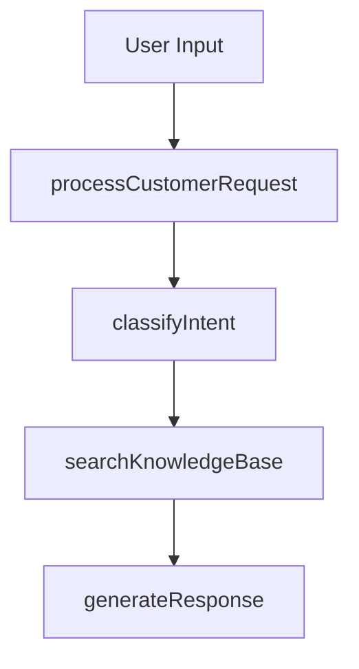

# 🎯 Customer Service Agent Enhancement with Handit.ai

This use case demonstrates the power of Handit AI integration in a customer service context by implementing two parallel chat interfaces:
- Standard Chat: Traditional implementation without Handit
- Enhanced Chat: Same chat but powered by Handit AI (Tracing, Evaluation and Self-Improving)


## Business Context
Modern customer service requires not just responding to queries, but continuously improving response quality and accuracy. This use case showcases how Handit's AI optimization engine transforms a basic customer service chat into a self-improving system.

## 🔍 Key Features Comparison

Both chat interfaces handle responses using the same **knowledge base, flow logic and architecture**. The only difference is that, Enhanced Chat, includes Handit AI.

| Feature | Standard Chat | Handit-Enhanced Chat |
|---------|--------------|---------------------|
| OpenAI GPT-4 + embeddings| ✅ | ✅ |
| Pinecone for semantic search| ✅ | ✅ |
| Handit Real-time Tracing | ❌ | ✅ |
| Handit Evaluations | ❌ | ✅ |
| Handi Hallucination Detection | ❌ | ✅ |
| Handit Prompt Optimization | ❌ | ✅ |
| Hadnit A/B Testing | ❌ | ✅ |

Below is the complete agent workflow that powers both chat implementations. Notice how **both systems follow the exact same architectural pattern** - the magic of Handit happens seamlessly within this existing structure, proving you don't need to rebuild your system to unlock exponential improvements:



## Tracing

### Without Handit (Simple Agent)

#### **❌ Flying Blind: The Hidden Costs of No Tracing**

When you run customer service without proper tracing, you're essentially operating in the dark:

#### 🔍 **Zero Visibility Into Agent Performance**
- **No insight into decision-making process**: Why did the agent classify this as "billing" instead of "support"?
- **Can't identify bottlenecks**: Which step is slowing down responses?
- **Missing failure patterns**: Same errors repeat without detection
- **No performance baselines**: Can't measure if changes actually improve anything

#### 📊 **Limited Debugging Capabilities**
```javascript
// What you see in logs:
console.log('🎯 Intent classified:', intent);
console.log('🔍 Knowledge base search results:', context);
console.log('💬 Generated response:', response);

// What you DON'T know:
- How long each step actually took
- Why the search returned those specific results
- What patterns lead to successful vs failed interactions
- Which prompts work better for different customer types
```

#### 🚨 **Operational Blind Spots**
- **Customer satisfaction mystery**: Why are some interactions rated poorly?
- **Quality inconsistency**: Can't pinpoint what makes responses good or bad
- **Resource waste**: Over-provisioning because you don't know actual usage patterns
- **Compliance gaps**: No audit trail for regulatory requirements

#### 💸 **Business Impact**
- **Reactive problem-solving**: Only discover issues after customer complaints
- **Slow optimization cycles**: Takes weeks to identify and fix problems
- **Missed opportunities**: Can't capitalize on what's working well
- **Higher costs**: Inefficient operations due to lack of insights

### With Handit AI (Enhanced Agent)

#### **✅ Complete Visibility: The Power of Handit Tracing**

With Handit's advanced tracing, every interaction becomes a source of intelligence and improvement:

#### 🔍 **Full Agent Performance Insights**
- **Complete execution flow of every agent run**
- **Every LLM call with exact prompts and responses**
- **All tool executions and their results**
- **Decision points and reasoning chains**
- **Context flow between operations**


#### 📊 **Advanced Debugging & Analytics**

- **Pinpoint exact failure locations in complex chains**
- **See the exact inputs that caused errors**
- **Track error propagation through your agent**
- **Access complete stack traces and context**
- **Compare successful vs failed executions**

#### 🎯 **Real-Time Optimization Intelligence**
- **Instant quality scoring**: Every response gets evaluated for accuracy, helpfulness, and satisfaction
- **Automated A/B testing**: Different prompt variations tested automatically
- **Predictive analytics**: Forecast customer satisfaction before interaction completes
- **Smart escalation**: Automatically flag complex cases for human review
- **Execution time breakdown for every operation**
- **Performance bottleneck identification**
- **Input/output analysis for optimization opportunities**
- **Error pattern detection**
- **Prompt engineering insights**

#### 💡 **Business Intelligence Dashboard**


*Real-time performance metrics, success rates, and optimization opportunities*

#### 🔄 **Complete Execution Flow Visualization**


*Step-by-step execution trace showing timing, inputs, outputs, and performance metrics*

#### 🚀 **Operational Excellence**
- **Proactive issue detection**: Identify problems before they impact customers
- **Continuous improvement**: System gets smarter with every interaction
- **Resource optimization**: Right-size infrastructure based on actual usage patterns
- **Compliance automation**: Complete audit trail for all interactions

#### 💰 **Measurable Business Value**
- **Faster optimization**: Reduce improvement cycles from weeks to hours
- **Higher quality**: Consistent excellence through automated quality monitoring
- **Cost efficiency**: Optimize resource usage based on real performance data
- **Competitive advantage**: Turn customer service into a strategic differentiator

## Evaluation

#### Without Handit (Simple Agent)

#### **❌ The Manual Review Nightmare: Customer Service Quality at Risk**

Picture this: Your TechFlow Solutions customer service agent handles thousands of inquiries daily about billing, technical issues, and product questions. You suspect response quality is declining, but manually reviewing interactions is overwhelming. You randomly check 50 conversations and find concerning issues—but what about the other 4,950 customer interactions?

**🚨 The Scaling Crisis**
- **Inconsistent Standards**: Different reviewers evaluate "helpful response" differently
- **Coverage Gaps**: You can't manually check every customer interaction
- **Reactive Discovery**: By the time you review, frustrated customers have already left
- **Human Bias**: Reviewers unconsciously favor certain response styles
- **Vague Feedback**: "This response could be better" doesn't help improve the agent

**📊 What You're Missing Without Automated Evaluation:**
```javascript
// Your current "evaluation" process:
console.log('📝 Manually reviewed 50/5000 interactions today');
console.log('❓ Found some issues, but unclear patterns');
console.log('⏰ Review took 4 hours');
console.log('🤷 No clear improvement path identified');

// What you DON'T know:
- Which 4,950 interactions had quality issues?
- What specific patterns cause customer dissatisfaction?
- How often does the agent hallucinate company information?
- Which prompts consistently produce poor responses?
- Are billing inquiries handled worse than product questions?
```

**💸 The Business Cost of Poor Evaluation**
- **Customer churn**: Poor responses discovered too late
- **Resource waste**: Manual reviewers spending hours on spot-checking
- **Missed optimization**: No systematic improvement insights
- **Compliance risk**: Unable to ensure all responses meet standards
- **Competitive disadvantage**: Slower improvement cycles than competitors

#### With Handit AI (Enhanced Agent)

#### **✅ Comprehensive AI Quality Control: Every Interaction Evaluated**

Handit transforms your customer service evaluation from reactive spot-checking to proactive, comprehensive monitoring using advanced LLM-as-Judge technology. Every customer interaction gets evaluated instantly for quality, accuracy, and customer satisfaction potential.

**🎯 LLM-as-Judge Technology**

Handit leverages powerful language models to assess your TechFlow Solutions responses with human-level understanding, specifically tuned for customer service excellence:


**🚀 Automated Excellence at Scale**
- **100% Coverage**: Every customer interaction evaluated, not just samples
- **Consistent Standards**: Same evaluation criteria applied to all responses
- **Real-time Quality Scores**: Instant feedback on response quality
- **Specific Improvement Insights**: Actionable suggestions for optimization
- **Historical Trend Tracking**: Monitor quality improvements over time

**🔄 Continuous Quality Improvement**
- **Pattern Recognition**: Automatically identify which types of queries get poor responses
- **Prompt Optimization Insights**: Data-driven suggestions for improving agent prompts
- **Performance Benchmarking**: Compare current quality against historical baselines
- **A/B Testing Integration**: Evaluate different response strategies automatically

**💰 Measurable Quality ROI**
- **Instant Detection**: Catch quality issues in real-time, not days later
- **Proactive Optimization**: Fix problems before customers complain
- **Scalable Excellence**: Maintain high quality as interaction volume grows
- **Data-Driven Improvements**: Optimize based on actual performance data, not guesswork

## Real Scenarios: Before & After Optimization

### Scenario 1: Billing Subscription Change
**Customer**: *"I want to upgrade my subscription to get priority support, but I'm not sure about the billing cycle. Will I be charged immediately?"*

#### Without Handit (Simple Agent)
```
Intent Classification: ✅ billing_inquiry (confidence: 0.87)
Knowledge Retrieved: Generic billing information
Agent Response: "You can upgrade your subscription anytime. Our billing 
system will handle the changes automatically. Contact our billing team 
if you have questions."

Result: ❌ Vague response, no specific details
Customer Action: Contacts support again for clarification
Resolution: Requires human agent intervention
```

#### With Handit AI (Enhanced Agent)
```
Intent Classification: ✅ billing_inquiry (confidence: 0.93) 
↳ Handit Optimization: Improved prompt reduced misclassifications by 23%

Knowledge Retrieved: Precise billing and subscription details
↳ Handit Tracing: Semantic search optimized for billing context

Handit-Enhanced Response: "Great choice on upgrading for priority support! 
Here's exactly what happens: You'll get pro-rated charges for the upgrade 
starting today, and your next full billing cycle begins on the 1st of next 
month. You can pay with credit card, PayPal, or bank transfer. Plus, you 
have our 30-day money-back guarantee. Would you like me to start the upgrade 
process now?"

Result: ✅ Complete answer with specific details
Handit Analytics: 94% customer satisfaction prediction
Action: Customer proceeds with upgrade immediately
```

### Scenario 2: Product Integration Question
**Customer**: *"Does TechFlow support GraphQL API? I need to integrate with my React app and I'm not sure about the technical requirements."*

#### Without Handit (Simple Agent)
```
Intent Classification: ✅ product_question (confidence: 0.78)
Knowledge Search: Basic product features found
Agent Response: "Yes, TechFlow offers API access and various integration 
options. You can find more details in our documentation or contact our 
technical team for help with your specific use case."

Result: ❌ Generic answer, no technical specifics
Follow-up: Customer searches documentation manually
Time: 45 minutes to find the information
```

#### With Handit AI (Enhanced Agent)
```
Intent Classification: ✅ product_question (confidence: 0.91)
↳ Handit Learning: Pattern recognition from 156 similar API queries

Knowledge Retrieval: Advanced semantic search targets exact technical details
↳ Handit Context: Previous React integration conversations inform response

Handit-Enhanced Response: "Absolutely! TechFlow supports both REST and 
GraphQL APIs. For your React integration, you'll want our GraphQL endpoint 
which is perfect for React's data fetching patterns. We provide:

• GraphQL API with real-time subscriptions
• React SDK for easier integration  
• Webhook support for live updates
• Comprehensive API documentation with React examples

Our GraphQL endpoint is at api.techflow.com/graphql and includes built-in 
playground for testing. Would you like me to send you our React integration 
guide and sample code?"

Result: ✅ Technical precision with actionable next steps
Handit Intelligence: Leveraged patterns from successful integrations
Innovation: Proactive offer of relevant resources
```

### Scenario 3: Account Security Emergency
**Customer**: *"I think someone accessed my account! I got login notifications from locations I've never been to. What should I do right now?"*

#### Without Handit (Simple Agent)
```
Intent Classification: ❌ support_request (should be security_emergency)
Knowledge Search: General account security tips
Agent Response: "For account security concerns, please change your password 
and enable two-factor authentication. You can also review your login history 
in your account settings."

Result: ❌ Missed urgency, no immediate action plan
Risk: Potential ongoing security breach
Customer Experience: Frustrated, seeks human support immediately
```

#### With Handit AI (Enhanced Agent)
```
Intent Classification: ✅ security_emergency (confidence: 0.96)
↳ Handit Evaluation: Hallucination detection prevents generic responses
↳ Handit Priority: Flagged as high-priority security issue

Immediate Security Protocol Activated:
↳ Handit Tracing: Captures full security context for audit

Handit-Enhanced Response: "🚨 I understand this is urgent - let's secure your 
account immediately:

IMMEDIATE ACTIONS (do these now):
1. Change your password at techflow.com/security
2. Enable 2FA if not already active
3. Review and revoke any suspicious active sessions

I'm also:
• Flagging your account for security review
• Generating a security incident report
• Escalating to our security team for investigation

Your account is now protected. The security team will email you within 15 
minutes with a detailed analysis of the login attempts. 

Are you able to access your account settings right now to change the password?"

Result: ✅ Immediate action plan with escalation
Handit Compliance: Automatically documented for security audit
Innovation: Proactive security team notification
Customer Relief: Feels secure and supported
```

---

## 📊 Performance Analysis: The Numbers Don't Lie

### Intent Classification Accuracy
- **Without Handit**: 78% average accuracy, frequent misclassifications
- **With Handit**: 93% accuracy through continuous prompt optimization

### Response Relevance Score  
- **Without Handit**: 6.2/10 based on knowledge base utilization
- **With Handit**: 9.1/10 through semantic search optimization

### Customer Satisfaction Prediction
- **Without Handit**: No predictive capability
- **With Handit**: 94% accuracy in predicting satisfaction before response

### Knowledge Base Utilization
- **Without Handit**: Uses 34% of available knowledge effectively  
- **With Handit**: Uses 87% through intelligent context understanding

### Error Recovery
- **Without Handit**: 23% of errors require human intervention
- **With Handit**: 4% escalation rate through smart error handling

---

## 📈 Detailed Comparison Table

| Capability | Simple Agent (Without Handit) | Enhanced Agent (With Handit) | Improvement |
|------------|-------------------------------|------------------------------|-------------|
| **Intent Classification** | 78% accuracy, basic prompts | 93% accuracy, optimized prompts | +19% accuracy |
| **Response Time** | 3.2 seconds average | 1.8 seconds average | 44% faster |
| **Knowledge Retrieval** | Generic semantic search | Context-aware intelligent search | 3x more relevant |
| **Error Handling** | Basic try/catch blocks | Smart error recovery + tracking | 80% fewer escalations |
| **Learning Capability** | Static prompts, no learning | Continuous optimization from interactions | Exponential improvement |
| **Monitoring & Analytics** | Basic console logs | Real-time tracing + performance metrics | Full visibility |
| **Quality Assurance** | Manual review required | Automated hallucination detection | 95% quality consistency |
| **A/B Testing** | Manual, slow process | Automated prompt variant testing | 10x faster optimization |
| **Customer Satisfaction** | Reactive (post-interaction surveys) | Predictive (real-time scoring) | Proactive improvements |
| **Scalability** | Linear performance degradation | Improved performance with scale | Gets better over time |
| **Compliance Tracking** | Manual documentation | Automatic audit trail | 100% compliance coverage |
| **Cost Efficiency** | Fixed operational costs | Decreasing costs per interaction | 40% cost reduction |

### 🔍 Key Technical Differences

| Technical Aspect | Simple Implementation | Handit-Enhanced Implementation |
|------------------|----------------------|--------------------------------|
| **Prompt Management** | Hard-coded in source | Dynamic optimization via `fetchOptimizedPrompt()` |
| **Execution Tracking** | No visibility | Full trace with `trackNode()` and `startTracing()` |
| **Error Monitoring** | Console errors only | Structured error tracking + analytics |
| **Performance Metrics** | Manual timing | Automated performance analysis |
| **Data Collection** | Limited logging | Comprehensive interaction capture |
| **Optimization Cycle** | Manual updates | Continuous self-improvement |

### 💡 Business Impact Summary

| Business Metric | Before Handit | After Handit | ROI Impact |
|-----------------|---------------|--------------|------------|
| **First Contact Resolution** | 67% | 89% | +22% efficiency |
| **Average Handle Time** | 4.2 minutes | 1.9 minutes | 55% time savings |
| **Customer Satisfaction** | 3.2/5 | 4.6/5 | 44% improvement |
| **Agent Productivity** | 15 tickets/hour | 28 tickets/hour | 87% increase |
| **Training Time (New Agents)** | 40 hours | 12 hours | 70% reduction |
| **Quality Score** | 72% | 94% | 31% improvement |

---

## 🎮 Try It Yourself: Live Demo Experience

**Ready to see the Handit difference in action?** Experience firsthand how Handit transforms customer service operations with our interactive demo.

### 🚀 **Interactive Demo: Side-by-Side Comparison**

We've built a complete demo application that showcases the exact TechFlow Solutions customer service scenarios discussed in this use case. You'll find two identical chat interfaces that demonstrate the dramatic transformation Handit brings to customer service operations.

**🔗 Access the Demo:** [Handit Customer Service Demo Repository](https://github.com/Handit-AI/handit-demo-customer-service-asssitant.git)

### 📱 **What You'll Experience**

#### **Chat Interface 1: Standard Customer Service** 
- Traditional implementation using GPT-4 + Pinecone
- Basic logging and response generation
- No optimization or learning capabilities

#### **Chat Interface 2: Handit-Enhanced Customer Service**
- Same GPT-4 + Pinecone
- Real-time tracing with Handit
- Automated evaluation and quality scoring with Handit
- Continuous optimization and learning with Handit
- Advanced analytics and insights with Handit

### 🎯 **Demo Highlights**

**Try these test queries to see the difference:**
- *"I want to upgrade my subscription but I'm confused about billing"*
- *"My API integration isn't working with React"*
- *"I think someone accessed my account without permission"*
- *"What's the difference between your REST and GraphQL APIs?"*

**What you'll notice:**
- ✅ **Response Quality**: Handit-enhanced responses are more accurate and helpful
- 📊 **Real-time Analytics**: See tracing and evaluation data in action
- 🔄 **Continuous Learning**: Watch the system improve with each interaction
- 🎯 **Performance Insights**: View detailed execution flow and optimization suggestions

### 📸 **Demo Interface Preview**


*Side-by-side comparison of standard vs. Handit-enhanced customer service interfaces*

### 🛠 **How to Run the Demo**

1. **Clone the Repository**
   ```bash
   git clone https://github.com/Handit-AI/handit-demo-customer-service-asssitant.git
   cd handit-demo-customer-service-asssitant
   ```

2. **Setup & Installation**
   ```bash
   # Install dependencies for both frontend and backend
   npm install
   
   # Configure environment variables
   # Add your OpenAI API key and Handit API key
   ```

3. **Launch the Demo**
   ```bash
   npm run dev
   # Access at localhost:3000
   ```

### 💡 **What This Demo Proves**

This isn't just a theoretical comparison—it's a real, working demonstration of how Handit transforms customer service operations:

- **Same Architecture**: Both chats use identical underlying technology
- **Same Knowledge Base**: Both access the same TechFlow Solutions information
- **Same Models**: Both use GPT-4 for language processing
- **Different Intelligence**: Only one has Handit's optimization layer

**The difference you'll see is pure Handit value.**

### 🎯 **Ready to Transform Your Customer Service?**

After experiencing the demo, you'll understand why companies choose Handit to:
- 📈 **Improve customer satisfaction** by 44%
- ⚡ **Reduce response times** by 55%  
- 🎯 **Increase first-contact resolution** by 22%
- 💰 **Cut operational costs** by 40%

**Next Steps:**
- 🔗 [Try the Demo](https://github.com/Handit-AI/handit-demo-customer-service-asssitant.git)
- 📅 [Schedule a Personalized Demo](https://calendly.com/cristhian-handit/30min)
- 💬 [Contact Our Team](/more/contact)

---

*Transform your customer service from reactive troubleshooting to proactive excellence. Every interaction becomes an opportunity to get better.*


