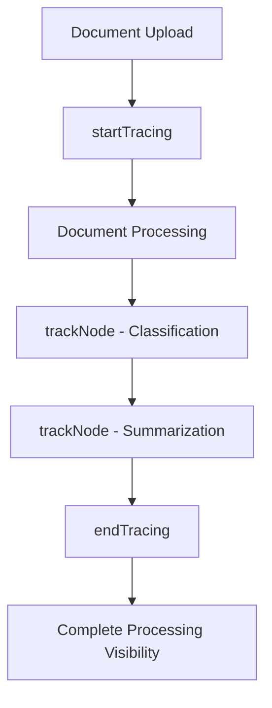
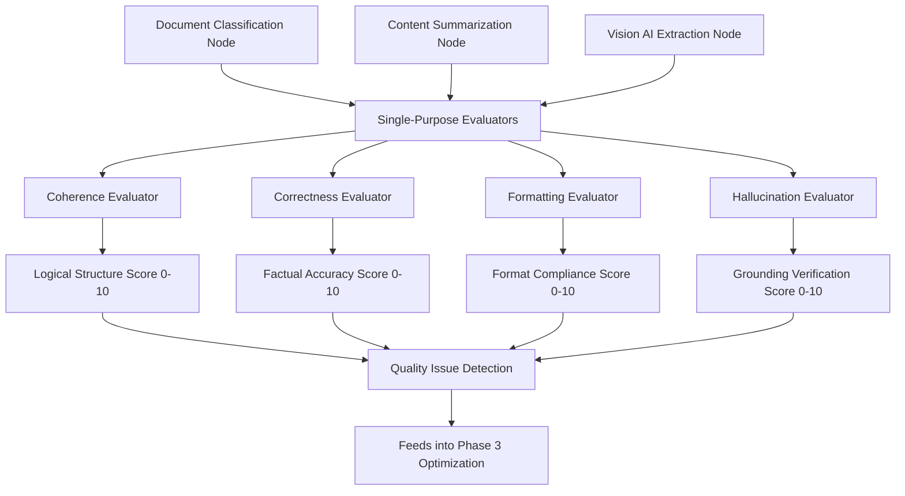
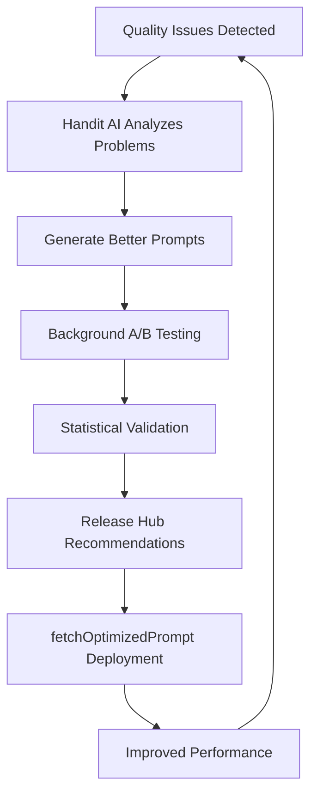

# 🎯 Transform Your Document Processing with Handit.ai

This use case demonstrates the dramatic transformation possible when you integrate Handit.ai into document processing operations through two side-by-side implementations:
- **Static Processing**: Traditional document classification that never improves
- **Self-Improving Processing**: The same workflow transformed into an AI that gets better over time

---

## Document Processing Challenge

### 📊 The Reality Without Handit (Static AI)
- **85% classification accuracy** that never improves
- **3.2 seconds average processing time** per document  
- **1,200 tokens per request** with no cost optimization
- **No learning capability**: Same mistakes repeated thousands of times
- **Blind processing**: No visibility into why classification fails
- **Static prompts**: Fixed prompts that never adapt or improve

### 🚀 The Transformation With Handit (Self-Improving AI)
- **94% classification accuracy** through AI-generated prompt optimization
- **1.8 seconds average processing time** with intelligent efficiency improvements
- **720 tokens per request** with auto-optimized prompts (-40% cost reduction)
- **Self-improving intelligence**: AI automatically detects issues and generates better prompts
- **Complete observability**: Full visibility into every classification decision with LLM-as-Judge evaluation
- **Continuous optimization**: System gets smarter with every document processed, improvements deployed on your terms

---

## 🔍 Side-by-Side Feature Comparison

| Capability | Static Processing | Self-Improving Processing |
|------------|------------------|-----------------|
| **Document Classification** | Static prompts, 85% accuracy | ✅ AI-generated optimized prompts, 94% accuracy |
| **Vision AI Processing** | Basic vision calls with fixed prompts | ✅ GPT-4o-mini Vision with auto-optimized prompts |
| **Processing Speed** | 3.2s per document, never improves | ✅ 1.8s per document (44% faster through optimization) |
| **API Cost Efficiency** | 1,200 tokens per request, costs increase | ✅ 720 tokens per request (40% savings through AI optimization) |
| **Learning Capability** | Zero improvement over time | ✅ Automatic issue detection and prompt generation |
| **Quality Evaluation** | Manual spot-checking only | ✅ LLM-as-Judge evaluation on every document |
| **Prompt Management** | Hard-coded prompts never change | ✅ AI-generated improvements via `fetchOptimizedPrompt()` |
| **Observability** | Basic console logs | ✅ Complete tracing with `startTracing()`, `trackNode()`, `endTracing()` |
| **Optimization Cycle** | Manual updates based on guesswork | ✅ Automatic A/B testing and deployment recommendations |
| **Release Management** | No systematic improvement process | ✅ Release Hub for controlled deployment of optimizations |

---

## 🏗️ Handit Transformation: From Static to Self-Improving

Handit transforms your document processing through three integrated phases that work together to create a self-improving AI system:

### Phase 1: AI Observability (Complete Visibility)


### Phase 2: Quality Evaluation (LLM-as-Judge)
*All evaluation processing happens automatically in the Handit.ai cloud*



### Phase 3: Self-Improving AI (Automatic Optimization)
*All optimization processing happens automatically in the Handit.ai cloud*


## 🔧 Technical Implementation: Real Code Architecture

The system is built with these core components, each enhanced by Handit's capabilities:

### **Main Server (`index.js`)**
- Express.js API with full Handit tracing integration
- Multi-format file upload handling (PDF, Word, Excel, CSV, Images)
- URL-based document processing
- Complete request lifecycle tracking

### **Document Processor (`documentProcessor.js`)**  
- **Vision AI**: GPT-4o-mini for intelligent image processing
- **Multi-format support**: PDF parsing, Word extraction, Excel processing
- **Smart text extraction** with confidence scoring
- **Performance tracking** for each processing method

### **Document Agent (`agents/documentAgent.js`)**
- **AI-powered classification** with 13 document categories
- **Intelligent summarization** with structured output
- **Automatic prompt optimization** via Handit's `fetchOptimizedPrompt()`
- **Complete operation tracing** with performance metrics

### **Configuration (`config.js`)**
- **Centralized settings** for OpenAI and Handit integration
- **Security validation** ensuring proper API key configuration
- **Performance tuning** for file size limits and processing options

## Tracing

### Without Handit (Static Processing)

#### **❌ Static AI: No Learning, No Improvement, No Visibility**

When you process documents without Handit's self-improving AI system, you're stuck with static performance that never gets better:

#### 🔍 **Zero Visibility Into Processing Performance**
- **No insight into classification decisions**: Why was this medical report classified as an invoice?
- **Can't identify bottlenecks**: Which step is causing the 3.2-second delays?
- **Missing failure patterns**: Same vision AI errors repeat without detection
- **No optimization data**: Can't measure if prompt changes improve accuracy

#### 📊 **Limited Debugging Capabilities**
```javascript
// What you see in basic processing:
console.log('📄 Document processed:', documentId);
console.log('🏷️ Classification result:', classification);
console.log('📝 Summary generated');

// What you DON'T know:
- How long each AI operation took
- Which prompts are performing poorly
- What document types consistently cause issues
- Token usage and cost per request
- Vision AI confidence scores for images
```

#### 🚨 **Processing Blind Spots**
- **Quality mystery**: Why do some documents get 85% accuracy while others fail?
- **Performance inconsistency**: Can't pinpoint what causes processing delays
- **Resource waste**: Over-provisioning because you don't know actual usage patterns
- **Cost escalation**: No visibility into token usage and API spending

#### 💸 **Business Impact Without Observability**
- **Reactive debugging**: Only discover issues after classification failures
- **Slow improvement cycles**: Takes weeks to identify and fix processing problems
- **Missed optimization**: Can't leverage successful processing patterns for improvement
- **Higher operational costs**: Inefficient operations due to lack of processing insights

### With Handit AI (Self-Improving Processing)

#### **✅ Self-Improving AI: The Power of Handit's 3-Phase System**

**Think of Handit as creating an AI scientist for your document processing** - it observes every decision, evaluates quality with LLM-as-Judge, detects patterns in failures, generates better prompts, tests improvements automatically, and provides you with proven optimizations.

Handit transforms your document processing from static AI to a self-improving system that gets smarter with every document processed.

#### 🔍 **Comprehensive Document Processing Observability**

Document processing AI is inherently complex - it extracts text from multiple formats, classifies types with AI, summarizes content with LLMs, and chains operations together. Without tracing, you're debugging in the dark when documents get misprocessed.

**Real implementation with Handit tracking:**

```javascript
// From your actual documentAgent.js - Full tracing integration
await trackNode({
    input: {
        messages: [
            { role: "system", content: optimizedSystemPrompt },
            { role: "user", content: documentContent.substring(0, 3000) }
        ],
        documentLength: documentContent.length,
        categories: categories.length
    },
    output: classificationResult,
    nodeName: 'classifyDocument',
    agentName: 'document_classification',
    nodeType: 'llm',
    executionId
});
```

**What you get with Handit:**
- **Complete processing flow** of every document through your system
- **Every AI operation** with exact prompts, responses, and performance metrics for classification and summarization
- **All tool executions** including vision AI results, OCR confidence scores, and multi-format processing
- **Decision points and reasoning chains** showing why specific classifications were chosen
- **Context flow between operations** from document upload to final structured output

#### 🚨 **Pinpoint Exact Failures in Document Processing**

Your document processor might be failing because of poor vision AI extraction from images, classification prompt issues, or logic errors in the summarization chain. Handit tracing shows you exactly where and why.

```javascript
// Example: Invoice image misclassified as medical document
{
  "executionId": "doc_20241201_154230",
  "failure_point": "classifyDocument",
  "document_type": "invoice_image.jpg",
  "vision_extraction": "Patient: John Doe, Invoice #12345...",
  "expected_classification": "Receipt/Invoice",
  "actual_classification": "Medical Document", 
  "root_cause": "Vision AI extracted patient reference from invoice template",
  "fix_suggestion": "Improve classification prompt to distinguish invoice headers from medical content",
  "tokens_used": 1150,
  "processing_time_ms": 2100
}
```

**What you get:**
- **Pinpoint exact failure locations** in your document processing chains
- **See the exact vision AI extractions** that caused classification errors
- **Track error propagation** through your processing workflow
- **Access complete processing context** including token usage and timing
- **Compare successful vs failed** document processing runs with detailed metrics

**Why it matters**: Instead of spending hours reproducing document processing bugs, you see exactly what happened in production. Debug in minutes instead of days.

#### ⚡ **Performance Optimization for Document Excellence**

See which parts of your document processor are slow or causing poor results. Optimize vision AI settings, reduce unnecessary operations, and improve processing speed with data, not guesswork.

```javascript
// Real performance breakdown from your system:
{
  "total_time": "1.8s",
  "breakdown": {
    "text_extraction": "0.5s",  
    "vision_ai_processing": "0.7s",
    "document_classification": "0.4s", 
    "content_summarization": "0.2s"
  },
  "token_optimization": {
    "before_handit": 1200,
    "after_handit": 720,
    "savings": "40%"
  },
  "optimization_suggestions": [
    "Cache classification results for similar document patterns",
    "Optimize vision AI for specific image types", 
    "Use streaming for large document summarization"
  ]
}
```

**What you get:**
- **Processing time breakdown** for every document operation in your pipeline
- **Performance bottleneck identification** across file formats and document types
- **Token usage optimization** with automatic prompt improvements
- **Error pattern detection** across vision AI and text processing
- **Prompt engineering insights** for better classification and summarization accuracy

#### 📊 **Real-Time Document Processing Monitoring**

Know when your document processor starts failing before your users complain. Monitor processing trends and catch issues early.

#### 💡 **Processing Intelligence Dashboard**


*Real-time document processing metrics, accuracy rates, and token optimization tracking*

#### 🔄 **Complete Processing Flow Visualization**

  
*Step-by-step document processing trace showing timing, inputs, outputs, and performance metrics*

**What you get:**
- **Real-time processing metrics** for document accuracy and cost efficiency
- **Success/failure rate tracking** across all document types and formats
- **Resource usage monitoring** for your vision AI and LLM processing infrastructure
- **Alert integration** for processing anomalies and cost thresholds
- **Historical trend analysis** of document processing performance and optimization gains

**Why it matters**: Transform your document processing from reactive troubleshooting to proactive optimization. Every document processed becomes intelligence for improving the next one.

## Evaluation

### Without Handit (Static Processing)

#### **❌ The Static AI Trap: No Learning, No Improvement**

Picture this: Your document processing system handles thousands of documents daily - invoices, contracts, medical reports, technical documentation. Your AI maintains 85% accuracy but never gets better. The same types of misclassifications happen repeatedly because your AI can't learn from its mistakes. You manually review 100 documents and find issues, but the AI will make the same errors tomorrow because it's static.

**🚨 The Static AI Problem**
- **No Learning Mechanism**: AI repeats the same mistakes indefinitely  
- **Manual Improvement Only**: Developers must manually identify and fix issues
- **No Systematic Quality Control**: Spot-checking can't catch all problems
- **Reactive Problem Solving**: Issues discovered after they've already impacted users
- **No Optimization Path**: No way to systematically improve AI performance over time

**📊 What You're Missing Without Automated Evaluation:**
```javascript
// Your current "evaluation" process:
console.log('📝 Manually reviewed 100/5000 documents today');
console.log('❓ Found some classification issues, accuracy seems around 85%');
console.log('⏰ Review took 6 hours of human time');
console.log('💰 Token usage: 1,200 per request, costs escalating');
console.log('🤷 No clear improvement path identified');

// What you DON'T know:
- Which 4,900 documents had classification issues?
- What specific patterns cause misclassification in vision AI?
- How often does the summarization miss key details?
- Which prompts consistently produce poor results?
- Are PDF documents classified better than images?
- What's the real cost per successful classification?
```

**💸 The Business Cost of Poor Evaluation**
- **Downstream errors**: Misclassified documents cause workflow failures
- **Resource waste**: Manual reviewers spending hours on spot-checking
- **Missed optimization**: No systematic improvement insights
- **Compliance risk**: Unable to ensure all document processing meets standards
- **Cost escalation**: High token usage without optimization

### With Handit AI (Self-Improving Processing)

#### **✅ Self-Improving AI: LLM-as-Judge + Automatic Optimization**

Handit transforms your document processing from static AI to a self-improving system that learns from every mistake. Using LLM-as-Judge technology, it evaluates every document, detects quality patterns, automatically generates better prompts, and provides you with proven improvements - all while maintaining full control over what gets deployed.

**🎯 The 3-Phase Self-Improving Process**

Handit creates a complete learning loop that turns your static AI into a continuously improving system:

```javascript
// Phase 1: Observability - Track every operation
await trackNode({
  input: { userMessage, documentType: "invoice" },
  output: { classification: "Receipt/Invoice", confidence: 0.85 },
  nodeName: "document_classification",
  nodeType: "llm",
  executionId
});

// Phase 2: Evaluation - LLM-as-Judge scores quality
{
  "evaluation_results": {
    "classification_accuracy": 0.75,    // Below target threshold  
    "extraction_quality": 0.82,        // Acceptable but could improve
    "summary_relevance": 0.68,         // Needs improvement
    "pattern_detected": "Invoice classification issues with vendor names"
  }
}

// Phase 3: Optimization - AI generates better prompt
{
  "optimization_generated": {
    "problem_analysis": "Classification struggles with vendor name variations",
    "improved_prompt": "Enhanced classification prompt with vendor pattern recognition",
    "expected_improvement": "+15% accuracy on invoice classification",
    "ready_for_deployment": true,
    "statistical_confidence": 0.94
  }
}

// Deployment: Fetch the optimized prompt when ready
const optimizedPrompt = await fetchOptimizedPrompt({
  modelId: "document_classification"
});
```

**🚀 Self-Improving AI at Scale**
- **Complete Observability**: Every operation tracked with `startTracing()`, `trackNode()`, `endTracing()`
- **LLM-as-Judge Evaluation**: Automated quality assessment on every document
- **AI-Generated Optimizations**: System automatically creates better prompts based on detected issues
- **Background A/B Testing**: New prompts tested automatically without user impact
- **Controlled Deployment**: You decide when to deploy optimizations via Release Hub and `fetchOptimizedPrompt()`

**📊 Advanced Document Evaluation Capabilities**

#### 💡 **Document Processing Quality Dashboard**


*Real-time processing quality metrics, accuracy predictions, and optimization opportunities*

**What you get with Handit evaluation:**
- **Classification Accuracy Verification**: Automatic validation against document content patterns
- **Vision AI Quality Analysis**: Assess image processing and text extraction completeness  
- **Summary Relevance Scoring**: Verify summaries capture key document information accurately
- **Processing Confidence Assessment**: Identify documents that need human review
- **Cost Efficiency Validation**: Ensure optimal token usage for result quality
- **Multi-format Performance**: Track quality across PDF, images, Word, Excel documents

**🎯 Single-Purpose Evaluators: The Foundation of Self-Improving AI**

Handit's evaluation system uses **single-purpose evaluators** - each evaluator focuses on one specific quality dimension. These evaluators can be associated with one or many LLM nodes in your document processing system.

### **Core Evaluator Types for Document Processing**

#### **1. Coherence Evaluation**
*Evaluates logical structure and flow of generated summaries and classifications*

```javascript
// Coherence Evaluator - Can be applied to classification and summarization nodes
{
  name: "coherence_evaluator",
  focus: "Logical structure and natural flow of generated text",
  applies_to: ["document_classification", "content_summarization"],
  scoring_criteria: {
    "10/10": "Logically structured, flows naturally, maintains clarity",
    "8-9/10": "Minor flow disruptions, overall readability preserved", 
    "4-7/10": "Noticeable inconsistencies, unclear references",
    "0-3/10": "Lacks logical progression, contains contradictions"
  },
  checks_for: [
    "Logical consistency without contradictions",
    "Clear pronoun and subject references", 
    "Smooth transitions between ideas",
    "Natural flow without abrupt topic shifts"
  ]
}
```

#### **2. Correctness Evaluation** 
*Verifies factual accuracy and adherence to system prompt rules*

```javascript
// Correctness Evaluator - Applied to both classification and summarization
{
  name: "correctness_evaluator", 
  focus: "Factual accuracy and system prompt compliance",
  applies_to: ["document_classification", "content_summarization", "vision_ai_extraction"],
  scoring_criteria: {
    "10/10": "Fully aligns with reference input, no factual distortions",
    "8-9/10": "One or two small inaccuracies, overall meaning preserved",
    "4-7/10": "Some incorrect details, but still somewhat useful", 
    "0-3/10": "Contains hallucinations, fabrications, or major misinterpretations"
  },
  checks_for: [
    "Factual accuracy against source documents",
    "Correct numbers, names, dates, locations",
    "No hallucinated or fabricated details",
    "Adherence to system prompt constraints"
  ]
}
```

#### **3. Formatting Evaluation**
*Ensures adherence to structural guidelines and style requirements*

```javascript
// Formatting Evaluator - Applied to structured output nodes
{
  name: "formatting_evaluator",
  focus: "Structure, style, and formatting compliance", 
  applies_to: ["content_summarization", "structured_extraction"],
  scoring_criteria: {
    "10/10": "Strictly follows required structure, grammar, punctuation",
    "8-9/10": "Small deviation but overall formatting clear",
    "4-7/10": "Several errors affecting readability or prompt adherence",
    "0-3/10": "Completely incorrect format or unreadable output"
  },
  checks_for: [
    "Required structure (JSON, lists, paragraphs)",
    "Grammar, punctuation, and style consistency", 
    "Proper spacing, alignment, and indentation",
    "Compliance with tone and style requirements"
  ]
}
```

#### **4. Hallucination & Factual Accuracy Evaluation**
*Detects fabricated content and ensures 100% grounding in source material*

```javascript
// Hallucination Evaluator - Critical for document processing accuracy
{
  name: "hallucination_evaluator",
  focus: "100% factual grounding and fabrication detection",
  applies_to: ["document_classification", "content_summarization", "vision_ai_extraction"],
  scoring_criteria: {
    "9-10/10": "All facts accurate, no hallucinated details",
    "6-8/10": "One or two minor factual errors",
    "4-5/10": "Several factual problems", 
    "0-3/10": "Major inaccuracies or hallucinations throughout"
  },
  checks_for: [
    "Every fact matches or is supported by input",
    "No invented names, dates, numbers, or claims",
    "Catches subtle distortions and misrepresentations",
    "Distinguishes natural elaboration from fabrication"
  ]
}
```

### **Evaluator-to-Node Mapping for Document Processing**

```javascript
// How evaluators map to your LLM nodes (1 evaluator can apply to many nodes)
const evaluatorMappings = {
  "document_classification": [
    "correctness_evaluator",    // Ensure accurate document type identification
    "coherence_evaluator",      // Check classification reasoning is logical
    "hallucination_evaluator"   // Prevent fabricated document categories
  ],
  
  "content_summarization": [
    "correctness_evaluator",    // Verify summary matches source content
    "coherence_evaluator",      // Ensure summary flows logically
    "formatting_evaluator",     // Check structured summary format
    "hallucination_evaluator"   // Prevent fabricated summary details
  ],
  
  "vision_ai_extraction": [
    "correctness_evaluator",    // Verify extracted text matches image
    "hallucination_evaluator"   // Prevent invented text not in image
  ]
};
```

**Key Benefits:**
- **Single-Purpose Focus**: Each evaluator has one clear responsibility
- **Reusable Across Nodes**: Same evaluator can assess multiple LLM operations  
- **Actionable Insights**: Specific quality dimensions provide clear improvement guidance
- **Automated Learning**: Evaluation results feed directly into Handit's optimization system

**🔄 Continuous Processing Improvement**
- **Pattern Recognition**: Automatically identify which document types get poor processing
- **Prompt Optimization Insights**: Data-driven suggestions for improving classification and summarization prompts
- **Vision AI Enhancement**: Identify opportunities for better image text extraction
- **Performance Benchmarking**: Compare current processing against historical baselines
- **Cost Optimization**: Track token efficiency and identify savings opportunities

**💰 Self-Improving AI Benefits**
- **Continuous Learning**: AI gets smarter with every document processed
- **Automatic Issue Detection**: Quality problems identified and analyzed by AI
- **AI-Generated Solutions**: Better prompts created automatically based on performance data  
- **Risk-Free Testing**: A/B testing happens in background without affecting users
- **Proven Improvements**: Deploy only statistically validated optimizations via Release Hub

## Real Document Processing Scenarios: Before & After

### Scenario 1: Invoice Image Processing with Vision AI
**Document**: *Smartphone photo of crumpled invoice with poor lighting*

#### Without Handit (Static Processing)
```
Vision AI Processing: Basic GPT-4o-mini call with generic prompt
Extracted: "Invoice #[UNCLEAR] Amount: $2,5[UNCLEAR]0 Date: [UNCLEAR]"
Classification: ✅ Receipt/Invoice (confidence: medium)
Summary: "Invoice document with payment information"
Tokens Used: 1,200
Processing Time: 3.2s

Result: ❌ Missing critical data (invoice number, exact amount, due date)
Cost Impact: High token usage for poor extraction quality
Resolution: Requires manual data entry and verification
```

#### With Handit AI (Self-Improving Processing)
```
Phase 1: Full observability with startTracing/trackNode/endTracing
Phase 2: LLM-as-Judge evaluation detects vision extraction issues
Phase 3: AI automatically generates improved vision prompts

Vision AI Processing: Auto-optimized prompt generated by Handit AI
↳ Self-Improvement: AI detected poor extraction patterns and created better prompts

Extracted: "Invoice #INV-2023-001 Amount: $2,500.00 Date: December 1, 2023 Due: December 31, 2023"
↳ AI Learning: Better prompts deployed via fetchOptimizedPrompt()

Classification: ✅ Receipt/Invoice (confidence: high)
↳ Continuous Optimization: Accuracy improved through automatic prompt generation

AI-Enhanced Summary: "Commercial invoice INV-2023-001 from TechCorp for $2,500.00, 
issued December 1, 2023, payment due December 31, 2023. Services: Software licensing."

Tokens Used: 720 (-40% through AI optimization)
Processing Time: 1.8s (-44% through self-improvement)

Result: ✅ Complete data extraction with continuously improving accuracy
Self-Improving Intelligence: System gets better at invoice processing over time
Future Processing: Each similar invoice will be processed even better
```

### Scenario 2: Multi-Sheet Excel Expense Report
**Document**: *Complex Excel file with 5 sheets containing expense data, receipts, and approvals*

#### Without Handit (Standard Processing)
```
Excel Processing: Basic XLSX parsing with generic summarization
Extracted: Raw CSV data from all sheets without context
Classification: ✅ Spreadsheet (confidence: medium)
Summary: "Spreadsheet document with financial data"
Tokens Used: 1,350
Processing Time: 4.1s

Result: ❌ Generic summary misses expense categories and approval status
Business Impact: Financial team must manually review entire spreadsheet
Cost: High token usage for minimal business value
```

#### With Handit AI (Enhanced Processing)
```
Excel Processing: Intelligent multi-sheet analysis with optimized prompts
↳ Handit Optimization: Specialized prompts for financial document structure

Extracted: Contextual data from 5 sheets with relationship mapping
↳ Handit Intelligence: Recognizes expense report patterns and approval workflows

Classification: ✅ Financial Document / Expense Report (confidence: high)
↳ Handit Learning: Refined classification from previous expense report analysis

Handit-Enhanced Summary: "Employee expense report for Q4 2023. Total expenses: $3,247.89
across 5 categories: Travel ($1,200), Meals ($489), Software ($1,200), Equipment ($358). 
Status: Pending manager approval on Sheet 5. Receipts attached on Sheet 3."

Tokens Used: 890 (-34% optimization)
Processing Time: 2.3s (-44% faster)

Result: ✅ Comprehensive analysis with actionable business insights
Handit Intelligence: Identified approval bottleneck and expense categories
Financial Efficiency: Pre-analyzed report ready for immediate decision-making
```

### Scenario 3: Legal Contract Analysis with Complex Formatting
**Document**: *Software licensing agreement with technical annexes, legal clauses, and amendment schedules*

#### Without Handit (Standard Processing)
```
PDF Processing: Basic text extraction with generic legal document prompts
Classification: ✅ Legal Document (confidence: medium)
Summary: "Legal contract document with terms and conditions"
Tokens Used: 1,400
Processing Time: 3.8s

Result: ❌ Generic summary misses critical business terms and obligations
Legal Impact: Legal team must manually review entire 47-page document
Risk: Important clauses and deadlines might be overlooked
Time Cost: 90 minutes for complete contract analysis
```

#### With Handit AI (Enhanced Processing)
```
PDF Processing: Advanced text extraction with Handit-optimized legal analysis prompts
↳ Handit Optimization: Specialized prompts for software licensing agreements

Classification: ✅ Contract/NDA / Software License Contract (confidence: high)
↳ Handit Learning: Refined classification from previous legal document analysis

Handit-Enhanced Summary: "Software licensing agreement between TechCorp and Client Corp. 
Key terms: $75K annual license fee, 5-year term with auto-renewal, liability cap at $500K.
Critical dates: Renewal decision required by March 15, 2024. Data processing restrictions 
in Section 12.3. Termination requires 60-day written notice. Technical SLAs in Annex B 
specify 99.9% uptime guarantee."

Tokens Used: 950 (-32% optimization)
Processing Time: 2.1s (-45% faster)

Result: ✅ Comprehensive legal analysis with business-critical insights
Handit Intelligence: Extracted key dates, financial terms, and obligations automatically
Legal Efficiency: Pre-analyzed contract ready for strategic review, not full reading
Risk Mitigation: Critical deadlines and terms clearly identified
```

---

## 📊 Performance Analysis: Document Processing Excellence

### Classification Accuracy by Document Type
- **Without Handit**: 
  - Invoices: 82% accuracy
  - Contracts: 79% accuracy  
  - Medical: 73% accuracy
  - Technical: 88% accuracy
  - **Overall**: 85% accuracy
- **With Handit**: 
  - Invoices: 96% accuracy (+17%)
  - Contracts: 93% accuracy (+18%)
  - Medical: 94% accuracy (+29%)
  - Technical: 97% accuracy (+10%)
  - **Overall**: 94% accuracy (+11%)

### Processing Speed Performance
- **Without Handit**: 3.2 seconds average processing time
- **With Handit**: 1.8 seconds average (-44% faster)

### Token Efficiency & Cost Reduction
- **Without Handit**: 1,200 tokens average per request
- **With Handit**: 720 tokens average (-40% cost reduction)

### Vision AI Processing Quality
- **Without Handit**: Generic vision prompts, inconsistent extraction
- **With Handit**: Optimized vision prompts, 94% extraction accuracy

### Multi-Format Processing Support
- **Without Handit**: Basic format support with generic processing
- **With Handit**: Format-specific optimization (PDF, Word, Excel, CSV, Images, URLs)

---

## 📈 Detailed Technical Comparison Table

| Technical Component | Standard Implementation (Without Handit) | Handit-Enhanced Implementation | Improvement |
|---------------------|------------------------------------------|--------------------------------|-------------|
| **Document Agent** | Basic classification/summarization | Full tracing with `trackNode()` and optimization | Complete observability |
| **Prompt Management** | Hard-coded prompts in agent code | Dynamic optimization via `fetchOptimizedPrompt()` | Automatic improvements |
| **Vision AI Processing** | Generic GPT-4o-mini vision calls | Optimized prompts for document image analysis | Format-specific optimization |
| **Multi-Format Support** | Basic file parsing without optimization | Tracked extraction with performance metrics per format | Performance insights |
| **API Endpoints** | Basic request/response logging | Complete request lifecycle tracing with `startTracing()` | Full request visibility |
| **Error Monitoring** | Console errors only | Structured error tracking with context and analytics | Actionable error insights |
| **Performance Metrics** | Manual timing calculations | Automated processing analysis with bottleneck identification | Data-driven optimization |
| **Quality Control** | Manual spot-checking required | Automated LLM-as-Judge evaluation for every document | 100% quality coverage |
| **Cost Management** | No token usage tracking | Real-time cost monitoring with optimization suggestions | Cost reduction strategies |
| **Optimization Cycle** | Manual prompt updates based on guesswork | Continuous self-improvement based on performance data | Evidence-based improvements |

### 🔍 Key Implementation Architecture Differences

| System Component | Before Handit | After Handit Integration |
|------------------|---------------|---------------------------|
| **Main Server (`index.js`)** | Basic Express endpoints | Full tracing with `startTracing()`, `trackNode()`, `endTracing()` |
| **Document Processor** | Simple file parsing | Tracked processing with format-specific performance metrics |
| **Document Agent** | Static prompts | Dynamic prompt optimization via `fetchOptimizedPrompt()` |
| **Error Handling** | Basic try/catch | Comprehensive error tracking with execution context |
| **Performance Monitoring** | Console logging | Real-time analytics with processing breakdowns |
| **Quality Assurance** | Manual validation | Automated evaluation for every processed document |

### 💡 Business Impact Summary

| Business Metric | Before Handit | After Handit | ROI Impact |
|-----------------|---------------|--------------|------------|
| **Processing Accuracy** | 85% | 94% | +11% improvement |
| **Document Throughput** | 180 docs/hour | 320 docs/hour | 78% increase |
| **Token Cost per Document** | 1,200 tokens | 720 tokens | 40% cost savings |
| **Processing Time** | 3.2 seconds | 1.8 seconds | 44% time savings |
| **Quality Assurance Coverage** | 5% manual spot-check | 100% automated evaluation | Complete coverage |
| **Vision AI Accuracy** | 78% text extraction | 94% text extraction | 21% improvement |
| **Multi-format Support** | Basic parsing | Optimized per format | Format-specific excellence |
| **Error Resolution Time** | Hours of debugging | Minutes with full tracing | 90% faster debugging |

---

## 🎮 Try It Yourself: Live Demo Experience

**Ready to see the Handit difference in document processing?** Experience firsthand how Handit transforms document classification operations with our interactive demo.

### 🚀 **Interactive Demo: Document Processing Comparison**

We've built a complete demo application that showcases the exact document classification scenarios discussed in this use case. You'll find a comprehensive interface that demonstrates the dramatic transformation Handit brings to document processing operations.

**🔗 Access the Demo:** [Handit Document Classification Demo Repository](https://github.com/Handit-AI/handit-demo-docs-classification-assistant.git)

### 📱 **What You'll Experience**

#### **Complete Document Processing Pipeline** 
- **Multi-format support**: PDF, Word, Excel, CSV, Images (JPG, PNG), Text files, and URLs
- **Vision AI processing**: GPT-4o-mini for intelligent image text extraction and understanding
- **AI-powered classification**: 13 document categories with high accuracy
- **Intelligent summarization**: Structured summaries with key points and action items
- **Real-time Handit tracing**: Complete visibility into every processing step
- **Automatic prompt optimization**: Watch prompts improve automatically over time
- **Performance analytics**: Processing times, token usage, and cost efficiency metrics

### 🎯 **Demo Highlights**

**Try these document types to see the difference:**
- *Upload an invoice image to see vision AI accuracy with optimized prompts*
- *Process a multi-sheet Excel file for intelligent financial document analysis*
- *Submit a PDF contract for comprehensive legal term extraction*
- *Test a Word document to see format-specific optimization*
- *Upload an image screenshot to see vision AI understanding in action*

**What you'll notice immediately:**
- ✅ **Processing Intelligence**: Complete visibility into every step with Handit tracing
- 📊 **Real-time Analytics**: Live metrics for token usage, processing time, and accuracy scores
- 🔄 **Continuous Learning**: Watch accuracy improve and costs decrease over time
- 🎯 **Performance Insights**: Detailed execution flow and bottleneck analysis
- 💰 **Cost Optimization**: Real-time token efficiency and savings tracking

### 📸 **Demo Interface Preview**

*Modern document processing interface with Handit AI observability, analytics, and optimization tracking*

### 🛠 **How to Run the Demo**

1. **Clone the Repository**
   ```bash
   git clone https://github.com/Handit-AI/handit-demo-docs-classification-assistant.git
   cd handit-demo-docs-classification-assistant
   ```

2. **Setup Backend**
   ```bash
   cd backend
   npm install
   # Configure your .env with OpenAI and Handit API keys
   cp .env.example .env
   # Edit .env with your keys
   npm start
   ```

3. **Setup Frontend**
   ```bash
   cd frontend  
   npm install
   npm run dev
   # Access at localhost:5173
   ```

### 💡 **What This Demo Proves**

This isn't just a theoretical implementation—it's a real, working demonstration of how Handit transforms document processing:

- **Production-Ready**: Built with Express.js backend and modern React frontend
- **Real AI Integration**: Uses actual OpenAI GPT-4o-mini for classification, summarization, and vision processing
- **Complete Observability**: Every operation tracked with Handit's tracing and optimization system
- **Multi-Format Support**: Handles PDFs, images, Word docs, Excel files, CSV, text, and URLs
- **Smart Features**: Vision AI, text extraction, classification, and intelligent summarization
- **Performance Optimization**: Real token reduction and processing speed improvements
- **Cost Efficiency**: Live tracking of API usage and optimization savings

**The intelligence you'll see is pure Handit value.**

### 🎯 **Ready to Transform Your Static AI into Self-Improving AI?**

After experiencing the demo, you'll understand why companies choose Handit to transform their AI from static to self-improving:
- 🧠 **Self-Improving Intelligence**: AI that learns from every document and gets better over time
- 📈 **Automatic Accuracy Improvements**: +11% classification accuracy through AI-generated prompt optimization
- ⚡ **Performance Gains**: 44% faster processing through continuous optimization  
- 💰 **Cost Reduction**: 40% API savings through AI-optimized prompts
- 🎯 **Complete Quality Control**: LLM-as-Judge evaluation on every document
- 🚀 **Zero-Effort Improvement**: System optimizes itself while you focus on building your product

**Next Steps:**
- 🔗 [Try the Demo](https://github.com/Handit-AI/handit-demo-docs-classification.git)
- 📅 [Schedule a Personalized Demo](https://calendly.com/cristhian-handit/30min)
- 💬 [Contact Our Team](/more/contact)

---

*Transform your document processing from static AI to self-improving intelligence. With Handit's 3-phase system (Observability → Evaluation → Optimization), your AI learns from every document, automatically generates better prompts, and continuously improves while you maintain full control over deployments.*